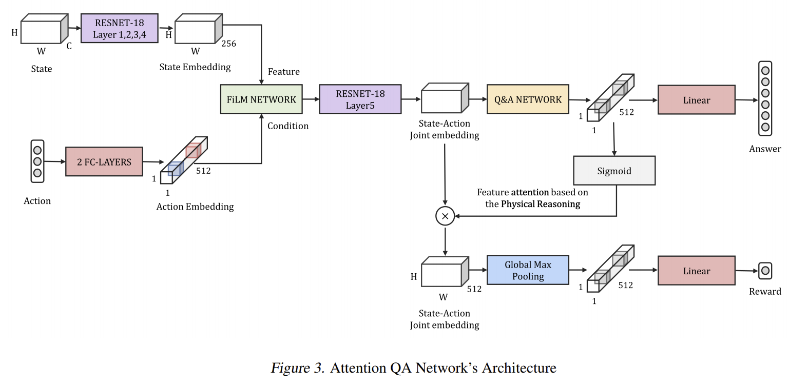

Question Answering Network for Physical Reasoning
===============

## Introduction

This is the repository to evaluate the question-answering module for physical reasoning in PHYRE benchmark. 
Our goal is to let agent learn the generalized physical representation through reasoning module.
(Deep Learning, Korea University)

## Method

Learned embedding from question-answer module is applied into the main network through FiLM-based attention.

## Results

|Models |Cross|Within|
|---|---|---|
|DQN|36.8|77.6|
|ATQAN|**39.0**|**80.2**|

Our model was able to surpass the baseline through AUCESS score, in PHYRE-B task.

## References

[PHYRE](https://phyre.ai/)
